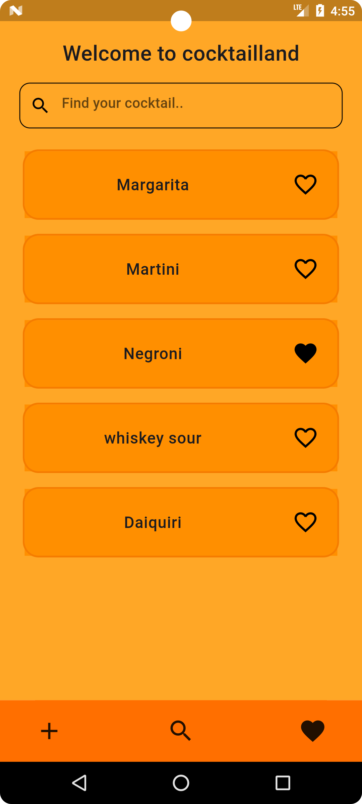
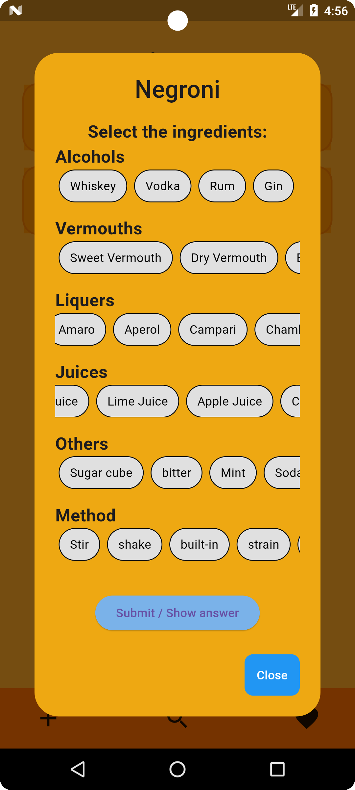
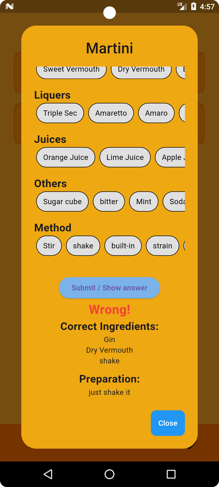
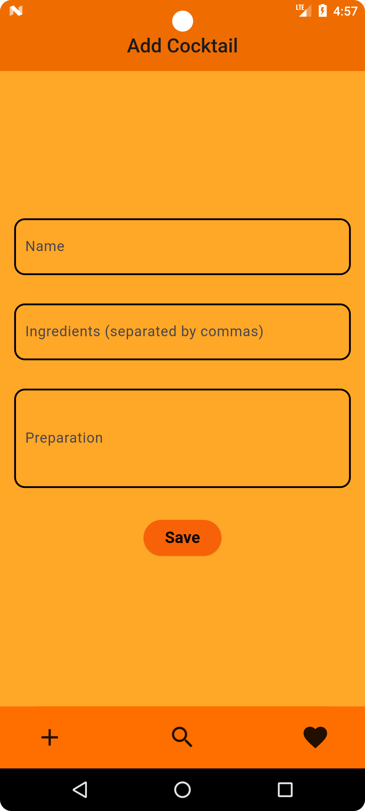

# CocktailLand
Welcome to the CocktailLand! This Flutter application allows users to add, delete, and favorite cocktail cards for easy reference and memorization. It's perfect for cocktail enthusiasts looking to expand their drink repertoire.

## Screenshots





## Installation
To get started CocktailLand, follow these steps:

### Prerequisites
Flutter SDK: [Install Flutter](https://flutter.dev/docs/get-started/install)
A suitable IDE (e.g., Android Studio, Visual Studio Code)

### Steps

1. **Clone the Repository**:
```bash
git clone https://github.com/ismailerd1/cocktailland.git
cd cocktail-flashcard-app
```
2. **Install dependencies:**:
```bash
flutter pub get
```
3. **Run the application:**:
```bash
  flutter run
```

## Contributing
I'm waiting for your contributions! If you would like to contribute, please follow these steps:
1. **Fork the repository.**:
2. **Create a new branch:**:
```bash
  git checkout -b feature-name
```
3. **Make your changes and commit them:**:
```bash
  git commit -m 'Add some feature'
 ```
4. **Push to the branch:**:
```bash
  git push origin feature-name
```
5.**Submit a pull request.**

## License
This project is licensed under the MIT License. See the LICENSE file for details.

# CONTACT
If you have any questions or need assistance, please feel free to reach out.
my e-mail: ismailerdogan2003@gmail.com
